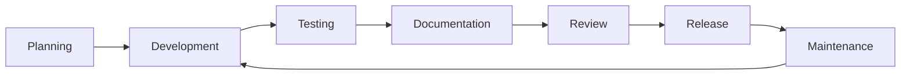

# SDK Development Guide

> **Building Production-Ready SDKs**  
> Comprehensive guide for developing, testing, and maintaining Susu Digital SDKs

---

## 📋 Table of Contents

- [Overview](#overview)
- [Development Environment](#development-environment)
- [SDK Architecture](#sdk-architecture)
- [Development Workflow](#development-workflow)
- [Code Standards](#code-standards)
- [Testing Strategy](#testing-strategy)
- [Documentation Requirements](#documentation-requirements)
- [Release Process](#release-process)
- [Maintenance Guidelines](#maintenance-guidelines)

---

## Overview

This guide provides comprehensive instructions for developing new SDKs and maintaining existing ones for the Susu Digital platform. Our SDKs are designed to provide consistent, reliable, and developer-friendly interfaces across multiple programming languages.

### Core Principles

- **Consistency**: Uniform API design across all language SDKs
- **Developer Experience**: Intuitive APIs with comprehensive documentation
- **Reliability**: Robust error handling and retry mechanisms
- **Performance**: Optimized for production workloads
- **Security**: Built-in security best practices
- **Maintainability**: Clean, well-documented, and testable code

### SDK Lifecycle



---

## Development Environment

### Prerequisites

- **Git**: Version control and collaboration
- **Docker**: Containerized development and testing
- **Node.js 18+**: For tooling and JavaScript SDK
- **Python 3.9+**: For Python SDK and tooling
- **Java 11+**: For Java SDK development
- **PHP 8.0+**: For PHP SDK development
- **Go 1.19+**: For Go SDK development

### Repository Structure

```
susu-digital-sdks/
├── .github/                    # GitHub workflows and templates
├── docs/                       # Documentation
├── tools/                      # Development tools and scripts
├── templates/                  # SDK templates and generators
├── tests/                      # Cross-SDK integration tests
├── javascript/                 # JavaScript/TypeScript SDK
├── python/                     # Python SDK
├── java/                       # Java SDK
├── php/                        # PHP SDK
├── go/                         # Go SDK
├── csharp/                     # C#/.NET SDK
├── ruby/                       # Ruby SDK
└── README.md
```#
## Development Tools Setup

```bash
# Clone the SDK repository
git clone https://github.com/mmabiaa/Susu-digital-sdks.git
cd sdks

# Install development dependencies
npm install

# Set up pre-commit hooks
npm run setup:hooks

# Start development environment
docker-compose up -d

# Run initial setup
npm run setup:dev
```

### Environment Configuration

```bash
# .env.development
SUSU_API_BASE_URL=https://api-sandbox.susudigital.app
SUSU_API_VERSION=v1
SUSU_TEST_API_KEY=sk_test_your_test_key
SUSU_TEST_ORG_ID=org_test_organization
SUSU_WEBHOOK_SECRET=whsec_test_webhook_secret

# Database for integration tests
TEST_DB_HOST=localhost
TEST_DB_PORT=5432
TEST_DB_NAME=susu_sdk_test
TEST_DB_USER=susu_test
TEST_DB_PASS=test_password

# Redis for caching tests
REDIS_HOST=localhost
REDIS_PORT=6379
```

---

## SDK Architecture

### Core Components

Every SDK must implement these core components:

#### 1. **Client Interface**
```typescript
interface SusuDigitalClient {
  // Service accessors
  customers(): CustomerService;
  transactions(): TransactionService;
  loans(): LoanService;
  savings(): SavingsService;
  analytics(): AnalyticsService;
  
  // Configuration
  getConfig(): SDKConfig;
  
  // Lifecycle
  close(): Promise<void>;
}
```

#### 2. **Service Layer**
```typescript
interface BaseService {
  // CRUD operations
  create<T>(request: CreateRequest): Promise<T>;
  getById<T>(id: string): Promise<T>;
  update<T>(request: UpdateRequest): Promise<T>;
  delete(id: string): Promise<void>;
  list<T>(request: ListRequest): Promise<PagedResult<T>>;
  
  // Async variants
  createAsync<T>(request: CreateRequest): Promise<T>;
  // ... other async methods
}
```

#### 3. **HTTP Client**
```typescript
interface HttpClient {
  request<T>(config: RequestConfig): Promise<Response<T>>;
  get<T>(url: string, config?: RequestConfig): Promise<Response<T>>;
  post<T>(url: string, data?: any, config?: RequestConfig): Promise<Response<T>>;
  put<T>(url: string, data?: any, config?: RequestConfig): Promise<Response<T>>;
  delete<T>(url: string, config?: RequestConfig): Promise<Response<T>>;
}
```

#### 4. **Authentication Manager**
```typescript
interface AuthManager {
  authenticate(): Promise<AuthToken>;
  refreshToken(): Promise<AuthToken>;
  isTokenValid(): boolean;
  getAuthHeaders(): Record<string, string>;
}
```

#### 5. **Error Handler**
```typescript
interface ErrorHandler {
  handleError(error: any): SusuError;
  isRetryable(error: SusuError): boolean;
  shouldRetry(error: SusuError, attempt: number): boolean;
}
```

### Data Models

#### Base Model Structure
```typescript
interface BaseModel {
  id: string;
  createdAt: Date;
  updatedAt: Date;
  version?: number;
}

interface Customer extends BaseModel {
  firstName: string;
  lastName: string;
  email: string;
  phone: string;
  status: CustomerStatus;
  // ... other fields
}
```--
-

## Development Workflow

### 1. Feature Development

```bash
# Create feature branch
git checkout -b feature/add-savings-goals

# Implement feature across relevant SDKs
# Start with TypeScript (reference implementation)
cd javascript/
npm run dev

# Implement in other languages
cd ../python/
python -m venv venv
source venv/bin/activate
pip install -e ".[dev]"

cd ../java/
./mvnw clean compile

# Run cross-language tests
cd ../
npm run test:integration
```

### 2. Code Generation

We use code generation to maintain consistency across SDKs:

```bash
# Generate models from OpenAPI spec
npm run generate:models

# Generate service interfaces
npm run generate:services

# Generate test fixtures
npm run generate:fixtures

# Update all SDKs
npm run generate:all
```

### 3. Testing Workflow

```bash
# Run unit tests for all SDKs
npm run test:unit

# Run integration tests
npm run test:integration

# Run performance tests
npm run test:performance

# Run security tests
npm run test:security

# Generate coverage reports
npm run test:coverage
```

---

## Code Standards

### Naming Conventions

#### Services and Methods
- **Create**: `create()`, `createAsync()`
- **Read**: `getById()`, `list()`, `search()`
- **Update**: `update()`, `patch()`
- **Delete**: `delete()`, `remove()`

#### Models and Types
- **Entities**: `Customer`, `Transaction`, `Loan`
- **Requests**: `CreateCustomerRequest`, `UpdateTransactionRequest`
- **Responses**: `CustomerResponse`, `TransactionListResponse`
- **Enums**: `CustomerStatus`, `TransactionType`

#### Error Handling
- **Base Exception**: `SusuException`
- **Specific Exceptions**: `SusuValidationException`, `SusuAuthException`
- **Error Codes**: `VALIDATION_ERROR`, `AUTH_FAILED`, `RATE_LIMITED`

### Language-Specific Standards

#### TypeScript/JavaScript
```typescript
// Use PascalCase for classes and interfaces
class SusuDigitalClient implements ISusuDigitalClient {
  // Use camelCase for methods and properties
  async createCustomer(request: CreateCustomerRequest): Promise<Customer> {
    // Implementation
  }
}

// Use kebab-case for file names
// customer-service.ts
// transaction-models.ts
```

#### Python
```python
# Use PascalCase for classes
class SusuDigitalClient:
    # Use snake_case for methods and properties
    async def create_customer(self, request: CreateCustomerRequest) -> Customer:
        # Implementation
        pass

# Use snake_case for file names
# customer_service.py
# transaction_models.py
```

#### Java
```java
// Use PascalCase for classes and interfaces
public class SusuDigitalClient implements ISusuDigitalClient {
    // Use camelCase for methods and properties
    public CompletableFuture<Customer> createCustomer(CreateCustomerRequest request) {
        // Implementation
    }
}

// Use PascalCase for file names
// CustomerService.java
// TransactionModels.java
```

#### PHP
```php
// Use PascalCase for classes
class SusuDigitalClient implements SusuDigitalClientInterface {
    // Use camelCase for methods and properties
    public function createCustomer(CreateCustomerRequest $request): Customer {
        // Implementation
    }
}

// Use PascalCase for file names
// CustomerService.php
// TransactionModels.php
```