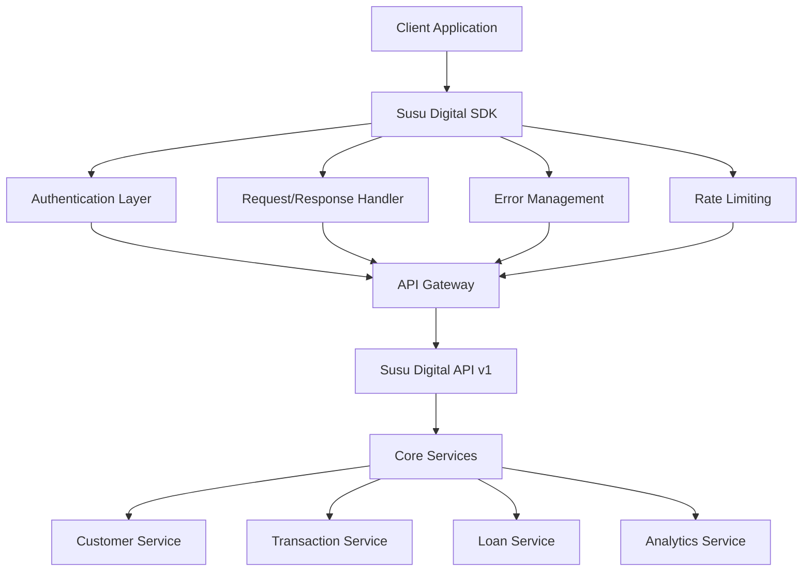

# Susu Digital SDK Development Documentation

> **Enterprise-Grade Integration Solutions**  
> Comprehensive SDK ecosystem for seamless integration with Susu Digital's microfinance platform

---

## 📋 Table of Contents

- [Overview](#overview)
- [SDK Architecture](#sdk-architecture)
- [Available SDKs](#available-sdks)
- [Integration Patterns](#integration-patterns)
- [Development Standards](#development-standards)
- [Security & Compliance](#security--compliance)
- [Support & Resources](#support--resources)

---

## Overview

The Susu Digital SDK ecosystem provides developers with robust, type-safe, and production-ready tools to integrate microfinance services into existing systems. Our SDKs abstract the complexity of financial operations while maintaining enterprise-grade security and compliance standards.

### Core Principles

- **Developer Experience First**: Intuitive APIs with comprehensive documentation
- **Type Safety**: Full TypeScript support across all JavaScript/Node.js SDKs
- **Security by Design**: Built-in authentication, encryption, and audit logging
- **Production Ready**: Battle-tested with automatic retry, rate limiting, and error handling
- **Compliance Focused**: Regulatory compliance built into every SDK operation

### Target Integrations

| Integration Type | Use Cases | Priority |
|------------------|-----------|----------|
| **Core Banking Systems** | Temenos, Finacle, Flexcube integration | High |
| **Mobile Applications** | Native iOS/Android apps with embedded finance | High |
| **Web Applications** | React, Vue, Angular financial dashboards | High |
| **Backend Services** | Python/Django, Node.js, PHP microservices | High |
| **Enterprise Software** | ERP, CRM, HR systems integration | Medium |
| **Business Intelligence** | Custom reporting and analytics platforms | Medium |
| **Mobile Money Platforms** | MTN MoMo, Vodafone Cash integration | High |
| **Payment Gateways** | Paystack, Flutterwave, Stripe integration | Medium |

---

## SDK Architecture

### Service-Oriented Design

Our SDKs are organized around core business domains that mirror our backend microservices architecture:

```
SusuDigitalSDK/
├── Authentication/     # API key management, OAuth, JWT handling
├── Customers/         # Customer lifecycle management
├── Transactions/      # Payment processing and transfers
├── Loans/            # Loan origination and servicing
├── Savings/          # Savings account management
├── Analytics/        # Business intelligence and reporting
├── Compliance/       # Audit trails and regulatory reporting
├── Notifications/    # Multi-channel communication
├── Webhooks/         # Real-time event handling
└── Organizations/    # Multi-tenant organization management
```

### Technical Architecture



### Core Components

#### 1. **Authentication Manager**
- API key validation and rotation
- JWT token management with automatic refresh
- OAuth 2.0 flow handling for third-party integrations
- Multi-factor authentication support

#### 2. **Request Handler**
- Automatic retry logic with exponential backoff
- Request/response logging and debugging
- Payload validation and sanitization
- Compression and optimization

#### 3. **Error Management**
- Structured error responses with actionable messages
- Error categorization (client, server, network, business logic)
- Automatic error reporting and telemetry
- Graceful degradation strategies

#### 4. **Rate Limiting & Throttling**
- Intelligent rate limit handling
- Queue management for high-volume operations
- Priority-based request scheduling
- Circuit breaker pattern implementation

---

## Available SDKs

### Production-Ready SDKs

| SDK | Language/Platform | Version | Status | Documentation |
|-----|------------------|---------|--------|---------------|
| **JavaScript/TypeScript** | Node.js, Browser | 2.1.0 | ✅ Production | [JS SDK Guide](./javascript-sdk.md) |
| **Python** | Python 3.8+ | 2.0.5 | ✅ Production | [Python SDK Guide](./python-sdk.md) |
| **PHP** | PHP 8.0+ | 1.8.2 | ✅ Production | [PHP SDK Guide](./php-sdk.md) |
| **Android** | Java/Kotlin | 1.5.0 | ✅ Production | [Android SDK Guide](./android-sdk.md) |
| **iOS** | Swift 5.0+ | 1.4.8 | ✅ Production | [iOS SDK Guide](./ios-sdk.md) |

### Development SDKs

| SDK | Language/Platform | Version | Status | ETA |
|-----|------------------|---------|--------|-----|
| **C#/.NET** | .NET 6+ | 0.9.0 | 🔄 Beta | Q3 2026 |
| **Java** | Java 11+ | 0.8.5 | 🔄 Beta | Q3 2026 |
| **Go** | Go 1.19+ | 0.7.0 | 🔄 Alpha | Q4 2026 |
| **Ruby** | Ruby 3.0+ | 0.6.0 | 🔄 Alpha | Q4 2026 |

### Specialized Integration Tools

| Tool | Purpose | Status | Documentation |
|------|---------|--------|---------------|
| **WordPress Plugin** | WordPress/WooCommerce integration | ✅ Production | [WordPress Guide](./wordpress-plugin.md) |
| **Zapier Integration** | No-code automation workflows | ✅ Production | [Zapier Guide](./zapier-integration.md) |
| **Power BI Connector** | Business intelligence dashboards | 🔄 Beta | [Power BI Guide](./powerbi-connector.md) |
| **Excel Add-in** | Spreadsheet-based operations | 🔄 Beta | [Excel Guide](./excel-addin.md) |

---

## Integration Patterns

### 1. **Direct API Integration**
Best for: Custom applications with full control requirements

```typescript
import { SusuDigitalClient } from '@susudigital/sdk';

const client = new SusuDigitalClient({
  apiKey: process.env.SUSU_API_KEY,
  environment: 'production',
  organization: 'your-org-id'
});

// Direct service calls
const customer = await client.customers.create({
  firstName: 'John',
  lastName: 'Doe',
  phone: '+233XXXXXXXXX',
  email: 'john.doe@example.com'
});
```

### 2. **Webhook-Driven Integration**
Best for: Event-driven architectures and real-time updates

```python
from susudigital import WebhookHandler

handler = WebhookHandler(
    secret_key=os.environ['SUSU_WEBHOOK_SECRET'],
    verify_signatures=True
)

@handler.on('transaction.completed')
def handle_transaction_completion(payload):
    # Update local systems
    update_customer_balance(payload['customer_id'], payload['amount'])
    send_notification(payload['customer_id'], 'Transaction completed')
```

### 3. **Batch Processing Integration**
Best for: High-volume operations and data synchronization

```php
<?php
use SusuDigital\BatchProcessor;

$processor = new BatchProcessor([
    'api_key' => $_ENV['SUSU_API_KEY'],
    'batch_size' => 100,
    'retry_attempts' => 3
]);

// Process bulk transactions
$results = $processor->transactions()->createBatch([
    ['customer_id' => 'CUST001', 'amount' => 100, 'type' => 'deposit'],
    ['customer_id' => 'CUST002', 'amount' => 50, 'type' => 'withdrawal'],
    // ... up to 1000 transactions per batch
]);
```

### 4. **Embedded Widget Integration**
Best for: Quick integration with minimal development

```html
<!-- Embedded customer portal -->
<div id="susu-customer-portal"></div>
<script src="https://cdn.susudigital.app/widgets/v2/customer-portal.js"></script>
<script>
  SusuWidgets.CustomerPortal.init({
    container: '#susu-customer-portal',
    apiKey: 'your-public-api-key',
    customerId: 'CUST001',
    theme: 'modern'
  });
</script>
```

---

## Development Standards

### Code Quality Standards

#### 1. **Type Safety**
- All SDKs must provide comprehensive type definitions
- Runtime type validation for critical operations
- Generic types for extensibility

#### 2. **Error Handling**
```typescript
// Standardized error structure across all SDKs
interface SusuError {
  code: string;           // Machine-readable error code
  message: string;        // Human-readable error message
  details?: any;          // Additional error context
  requestId: string;      // Unique request identifier for debugging
  timestamp: string;      // ISO 8601 timestamp
  retryable: boolean;     // Whether the operation can be retried
}
```

#### 3. **Logging & Observability**
- Structured logging with correlation IDs
- Performance metrics collection
- Distributed tracing support
- Debug mode for development environments

#### 4. **Configuration Management**
```typescript
interface SDKConfig {
  apiKey: string;
  environment: 'sandbox' | 'production';
  organization?: string;
  timeout?: number;
  retryAttempts?: number;
  enableLogging?: boolean;
  customHeaders?: Record<string, string>;
}
```

### Testing Standards

#### 1. **Unit Testing**
- Minimum 90% code coverage
- Mock external dependencies
- Test error scenarios and edge cases

#### 2. **Integration Testing**
- End-to-end API testing against sandbox environment
- Webhook delivery and signature verification
- Rate limiting and retry logic validation

#### 3. **Performance Testing**
- Load testing for high-volume scenarios
- Memory leak detection
- Network failure simulation

### Documentation Standards

#### 1. **API Documentation**
- OpenAPI 3.0 specifications
- Interactive examples with real data
- Code samples in multiple languages

#### 2. **SDK Documentation**
- Getting started guides with working examples
- Comprehensive API reference
- Migration guides between versions
- Troubleshooting and FAQ sections

---

## Security & Compliance

### Authentication & Authorization

#### 1. **API Key Management**
- Hierarchical key structure (organization → application → environment)
- Automatic key rotation capabilities
- Granular permission scoping
- Usage analytics and monitoring

#### 2. **Request Security**
- TLS 1.3 encryption for all communications
- Request signing with HMAC-SHA256
- Timestamp validation to prevent replay attacks
- IP whitelisting support

#### 3. **Data Protection**
- PII encryption at rest and in transit
- GDPR compliance with data portability
- Audit logging for all data access
- Automatic data retention policies

### Compliance Features

#### 1. **Regulatory Reporting**
- Bank of Ghana compliance reporting
- Anti-money laundering (AML) checks
- Know Your Customer (KYC) verification
- Transaction monitoring and alerts

#### 2. **Audit Trails**
- Immutable transaction logs
- User activity tracking
- System access monitoring
- Compliance report generation

---

## Support & Resources

### Developer Resources

#### 1. **Documentation Portal**
- **URL**: [developers.susudigital.app](https://developers.susudigital.app)
- Interactive API explorer
- SDK documentation and guides
- Code examples and tutorials
- Community forums and discussions

#### 2. **Development Tools**
- **Sandbox Environment**: Full-featured testing environment
- **Postman Collections**: Pre-built API request collections
- **CLI Tools**: Command-line utilities for testing and debugging
- **Webhook Testing**: Tools for webhook development and testing

#### 3. **Code Examples**
- **GitHub Repository**: [github.com/susudigital/sdk-examples](https://github.com/susudigital/sdk-examples)
- Sample applications in multiple languages
- Integration patterns and best practices
- Common use case implementations

### Support Channels

#### 1. **Technical Support**
- **Email**: [sdk-support@susudigital.app](mailto:sdk-support@susudigital.app)
- **Response Time**: 4 hours (business hours)
- **Escalation**: 24/7 for production issues
- **Languages**: English, Twi, French

#### 2. **Community Support**
- **Discord Server**: Real-time developer chat
- **Stack Overflow**: Tag questions with `susu-digital`
- **GitHub Issues**: Bug reports and feature requests
- **Developer Newsletter**: Monthly updates and tips

#### 3. **Professional Services**
- **Integration Consulting**: Custom integration planning
- **Code Review**: SDK implementation review
- **Training Programs**: Developer certification courses
- **Priority Support**: Dedicated support for enterprise clients

---

## Getting Started

### Quick Start Checklist

1. **Account Setup**
   - [ ] Create developer account at [developers.susudigital.app](https://developers.susudigital.app)
   - [ ] Generate API keys for sandbox environment
   - [ ] Review API documentation and rate limits

2. **SDK Installation**
   - [ ] Choose appropriate SDK for your platform
   - [ ] Install SDK via package manager
   - [ ] Configure authentication credentials

3. **First Integration**
   - [ ] Implement basic customer creation
   - [ ] Test transaction processing
   - [ ] Set up webhook handling
   - [ ] Implement error handling

4. **Production Readiness**
   - [ ] Security review and penetration testing
   - [ ] Performance testing and optimization
   - [ ] Monitoring and alerting setup
   - [ ] Compliance validation

### Next Steps

- **[Choose Your SDK](./sdk-selection-guide.md)** - Platform-specific SDK selection guide
- **[Authentication Setup](./authentication-guide.md)** - Detailed authentication configuration
- **[Integration Patterns](./integration-patterns.md)** - Common integration architectures
- **[Best Practices](./best-practices.md)** - Production deployment guidelines

---

**© 2026 Susu Digital. All rights reserved.**

*Last Updated: April 10, 2026*  
*Documentation Version: 2.1.0*
